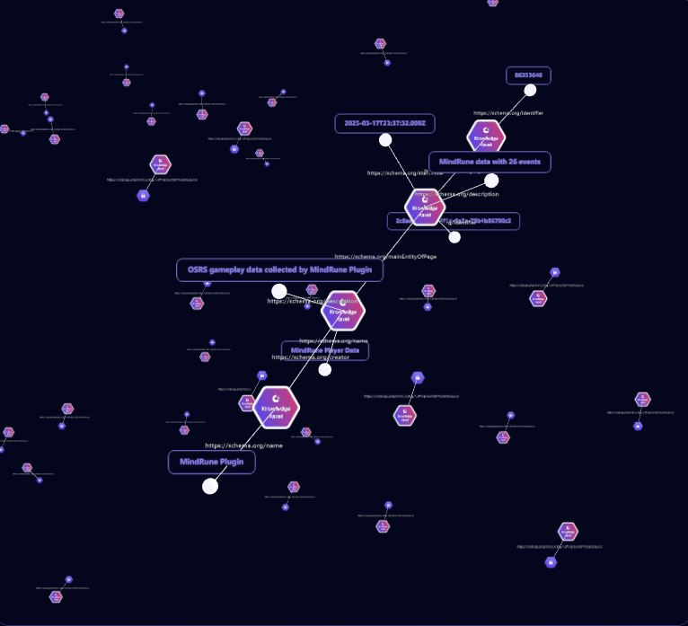

  

# MindRune Minter

The MindRune Minter allows MindRune contributors to retain ownership of the their data by creating a graph database of their memories and storing it inside of a token (Knowledge Asset) on the BASE Blockchain Network. The Minter simply "mints" the asset and sends it to your registered web3 wallet.

Every memory sent to MindRune is minted as an open source Knowledge Asset and sent to the contributor who created it.

To learn more about Knowledge Assets, please follow this link: [Origintrail Docs](https://docs.origintrail.io/)

Note: While it is possible to update the data in your memory token at any time, this may invalidate its usefulness in the future.

# Knowledge Asset Example

[Live Link](https://dkg-testnet.origintrail.io/explore?ual=did:dkg:base:84532/0xd5550173b0f7b8766ab2770e4ba86caf714a5af5/108257)

# Links

[Discord](https://discord.gg/74S5vRkNP7) - Our Discord server.
